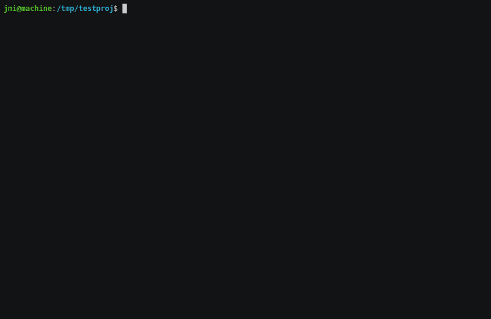

Mutaml: A Mutation Tester for OCaml [](https://github.com/jmid/mutaml/actions/workflows/ci.yaml)
===============================================

Mutaml is a mutation testing tool for OCaml.  
Briefly, that means Mutaml tries to change your code randomly to see
if the changes are caught by your tests.



In more detail: [Mutation testing](https://en.wikipedia.org/wiki/Mutation_testing) is
a form of fault injection used to assess the quality of a program's
testsuite. Mutation testing works by repeatedly making small, breaking
changes to a program's text, such as turning a `+` into `-`, negating
the condition of an `if-then-else`, ..., and subsequently rerunning
the testsuite to see if each such 'mutant program' is 'killed'
(caught) by one or more tests in the testsuite. By finding examples of
uncaught wrong behaviour, mutation testing can thereby reveal
limitations of an existing testsuite and indirectly suggest
improvements.

Since OCaml already prevents many potential programming errors at compile
time due to its strong type system, pattern-match compiler warnings, etc. Mutaml
favors mutations that
- preserve typing and
- would not be caught statically, e.g., changes in the values computed.

Mutaml consists of:

 - a [`ppxlib`](https://github.com/ocaml-ppx/ppxlib)-preprocessor that
   first transforms the program under test.
 - `mutaml-runner` that loops through a range of possible program mutations,
   and saves the output from running the test suite on each of the mutants
 - `mutaml-report` that prints a test report to the console.


Installation:
-------------

Installing Mutaml

```
$ git clone https://github.com/jmid/mutaml.git
$ cd mutaml
$ opam install .
```


Instructions:
-------------

How you can use `mutaml` depends on your project's build setup.
For now it has only been tested with `dune`, but it should work
with other build systems supporting an explicit two-staged build
process.


### Using Mutaml with `dune`

1. Mark the target code for instrumentation in your `dune` file(s):
   ```
   (library
     (public_name your_library)
     (instrumentation (backend mutaml)))
   ```
   Using `dune`'s [`instrumentation` stanza](https://dune.readthedocs.io/en/stable/instrumentation.html), your project's code is
   only instrumented when you pass the `--instrument-with mutaml`
   option.


2. Compile your test code with `mutaml` instrumentation enabled:
   ```
   $ dune build test --instrument-with mutaml
   ```
   assuming you have a `test/mytests.ml` test driver.
   This creates/overwrites an individual `lib.muts` file for each
   instrumented `lib.ml` file and an overview file
   `mutaml-mut-files.txt` listing them.
   These files are written to `dune`'s current build context.


3. Start mutaml-runner, passing the name of the test executable to run:
   ```
   $ mutaml-runner _build/default/test/mytests.exe
   ```
   This reads from the files written in step 2. Running the command also
   creates/overwrites the file `mutaml-report.json`.
   You can also pass a command that runs the executable through `dune`
   if you prefer:
   ```
   $ mutaml-runner "dune exec --no-build test/mytests.exe"
   ```

4. Generate a report, optionally passing the json-file
   (`mutaml-report.json`) created above:
   ```
   $ mutaml-report
   ```
   By default this prints `diff`s for each mutation that flew under
   the radar of your test suite. The `diff` output can be suppressed by
   passing `--no-diff`.


Steps 3 and 4 output a number of additional files.
These are all written to a dedicated directory named `_mutations`.


Instrumentation Options and Environment Variables
-------------------------------------------------

The preprocessor's behaviour can be configured through either
environment variables or instrumentation options in the `dune` file:

- `MUTAML_SEED` - an integer value to seed `mutaml-ppx`'s randomized
  mutations (overridden by instrumentation option `-seed`)
- `MUTAML_MUT_RATE` - a integer between 0 and 100 to specify the
  mutation frequency (0 means never and 100 means always - overridden
  by instrumentation option `-mut-rate`)
- `MUTAML_GADT` - allow only pattern mutations compatible with GADTs
  (`true` or `false`, overridden by instrumentation option `-gadt`)


For example, the following `dune` file sets all three instrumentation
options:
```
 (executable
  (name test)
  (instrumentation (backend mutaml -seed 42 -mut-rate 75 -gadt false))
 )
```
We could achieve the same behaviour by setting three environment
variables:
```bash
  $ export MUTAML_SEED=42
  $ export MUTAML_MUT_RATE=75
  $ export MUTAML_GADT=false
```
If you do both, the values passed as instrumentation options in the
`dune` file takes precedence.


Runner and Report Options and Environment Variables
---------------------------------------------------

`mutaml-runner` by default repeats test suite runs for all
instrumented `lib.ml` files. An option `--muts muts-file` is available
to enable more targeted mutation testing.  Running `mutaml-runner
--muts lib/lib2.muts _build/default/test/mytests.exe` will for example
only consider mutations of the corresponding library `lib/lib2.ml`.

By default, `mutaml-runner` also expects to find the preprocessor's output
files in the default build context `_build/default`. This can be
configured via an environment variable or a command-line option, e.g.,
if [instrumentation is enabled via another `dune-workspace` build context](https://dune.readthedocs.io/en/stable/instrumentation.html#enabling-disabling-instrumentation):

- `MUTAML_BUILD_CONTEXT` - a path prefix string (overridden by
  command-line option `--build-context`)


Currently `mutaml-report` uses `diff --color -u` as its default
command to print `diff`s. It falls back to `diff -u` when the
environment variable `CI` is `true`. The used command can also be
configured an environment variable:

- `MUTAML_DIFF_COMMAND` - the command and options to use instead,
  e.g. `MUTAML_DIFF_COMMAND="diff -U 5"` will disable colored outputs
  and add 5 lines of unified context. Mutaml expects the specified
  command to support `--label` options.


Status
------

This is an *alpha* release. There are therefore rough edges:

- Mutaml is designed to avoid repeated recompilation for each
  mutation. It does so by writing files during preprocessing which are
  later read during the `mutaml-runner` testing loop. As a consequence,
  if you attempt to merge steps 2 and 3 above into one step this will not work:
  ```
  $ mutaml-runner "dune test --force --instrument-with mutaml"
  ```
  The preprocessor in this case only writes the relevant files when
  `mutaml-runner` first calls the command, and thus *after* it needs the
  information contained in the files...

- There are [issues to force `dune` to
rebuild](https://github.com/ocaml/dune/issues/4390). This can affect
  Mutaml, e.g., in case just an environment variable changed. `dune
  clean` is a crude but effective work-around to this issue.

- The output files to `_build/default` are not registered with `dune`.
  This means rerunning steps 2,3,4 above will fail, as the additional
  output files in `_build/default` are not cached by `dune` and hence
  deleted. Again `dune clean` is a crude but effective work-around.

- ...


Mutations should not introduce compiler errors, be it type errors or
from the pattern-match compiler. If you encounter a situation where
this happens please report it in an issue.


Acknowledgements
----------------

Mutaml was developed with support from the [OCaml Software Foundation](https://ocaml-sf.org/).
